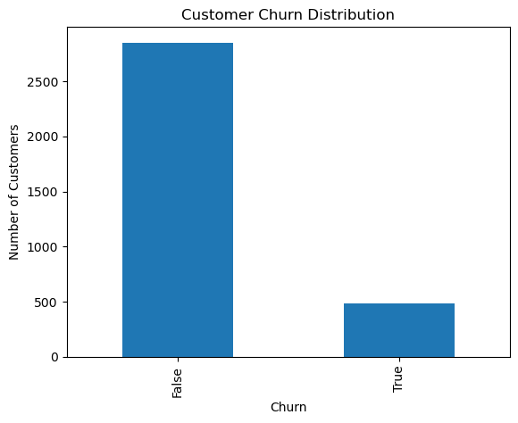
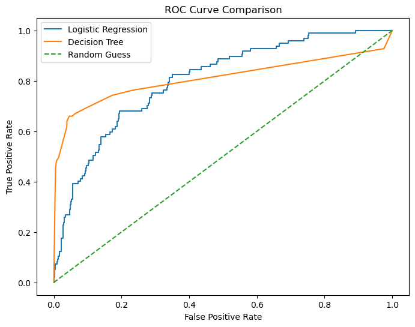

# Customer-Churn-Phase-3
Customer analytics and prediction project

# Telecom Customer Churn Prediction – SyriaTel

## Overview
Customer churn presents a significant revenue and growth challenge for telecommunications companies. This project focuses on predicting customer churn at SyriaTel using supervised machine learning. By identifying customers who are likely to leave, the company can take proactive retention actions that reduce revenue loss and improve customer satisfaction.

The goal of this analysis is not only to build an accurate predictive model, but also to translate model outputs into actionable business insights that support decision-making.

---

## Business Understanding
In a highly competitive telecom market, retaining existing customers is far more cost-effective than acquiring new ones. When customers churn, SyriaTel loses future revenue and must incur additional marketing and acquisition costs to replace them.

Customer churn is influenced by multiple interacting factors such as service usage patterns, subscription plans, and customer service experience. Because these relationships are complex and non-linear, a machine learning classification approach is well suited to identifying customers at risk of leaving before churn occurs.

This project frames churn prediction as a binary classification problem, where the business priority is correctly identifying churn-prone customers early enough to intervene.

---

## Data Understanding
The analysis uses the SyriaTel Customer Churn dataset, which contains 3,333 customer records and 21 features. Each row represents a single customer, with information covering service usage, subscription plans, and customer service interactions. The target variable, `churn`, indicates whether a customer stopped doing business with SyriaTel.

The dataset is imbalanced, with approximately 14.5% of customers having churned. This imbalance makes recall a particularly important evaluation metric, as failing to identify churners can result in missed retention opportunities.

📊 **Insert Visualization:** *Customer Churn Distribution*

---

## Exploratory Data Analysis
Exploratory analysis focused on identifying customer behaviors associated with increased churn risk. One of the strongest patterns observed was the relationship between customer service interactions and churn.

Customers who made three or more customer service calls were significantly more likely to churn, suggesting that unresolved issues and poor service experiences are key drivers of customer attrition. This insight highlights an opportunity for early intervention through improved support and escalation processes.

📊 **Insert Visualization:** *Churn Rate by Number of Customer Service Calls*

---

## Modeling Approach
The modeling process followed an iterative approach, starting with a simple baseline model and progressing to a more flexible non-parametric model.

A baseline logistic regression model was used to establish initial performance and provide interpretability. While the model performed well at identifying non-churners, it showed low recall for churned customers, limiting its usefulness for proactive churn prevention.

To capture non-linear relationships in customer behavior, a decision tree classifier was then introduced. Both a baseline and a tuned decision tree were evaluated. The tuned decision tree demonstrated a substantial improvement in recall while maintaining strong overall performance, making it more suitable for identifying customers at risk of churn.

---

## Model Evaluation
Models were evaluated using classification metrics, confusion matrices, and ROC-AUC scores. Recall was prioritized because the cost of missing a churn-prone customer is higher than incorrectly flagging a non-churner. The tuned decision tree achieved the best balance between recall and overall performance. It consistently outperformed the baseline logistic regression in identifying churned customers and demonstrated strong discriminatory ability based on ROC-AUC scores.

📊 **Insert Visualization:** *Confusion Matrix for Final Decision Tree Model*  

📊 **Insert Visualization:** *ROC Curve Comparison*

---

## Final Model Selection
The tuned decision tree classifier was selected as the final model. Its ability to model non-linear relationships and achieve higher recall makes it well suited for proactive churn prevention. While less interpretable than logistic regression, the performance gains justify its use as a decision-support tool.

---

## Business Recommendations
SyriaTel should deploy the model as an early-warning system to flag customers at high risk of churn. Customers with frequent customer service calls should be prioritized for proactive outreach and issue resolution. Improving service quality at the third customer service call may significantly reduce churn.

Additionally, customers with high usage patterns may benefit from tailored pricing plans or targeted offers to improve perceived value and reduce attrition risk.

---

## Limitations and Next Steps
This analysis is limited to historical service usage and customer interaction data and does not account for external factors such as competitor pricing or customer satisfaction surveys. Class imbalance may also impact predictions for minority churn cases.

Future work could include incorporating additional customer attributes, applying ensemble models, and implementing cross-validation to further improve model robustness and generalizability.
